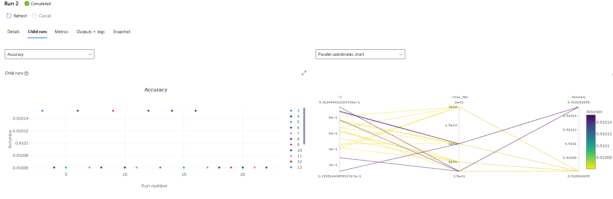
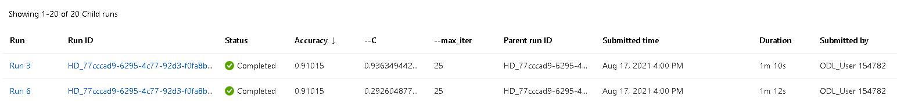
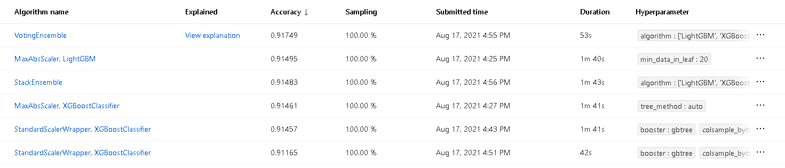
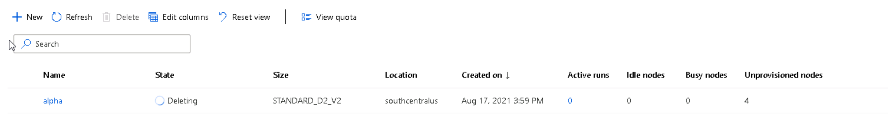

# Optimizing an ML Pipeline in Azure

## Overview
This project is part of the Udacity Azure ML Nanodegree.
In this project, we build and optimize an Azure ML pipeline using the Python SDK and a provided Scikit-learn model.
This model is then compared to an Azure AutoML run.

## Summary
**In 1-2 sentences, explain the problem statement: e.g "This dataset contains data about... we seek to predict..."**
The dataset contains data and information about bank customers who where target of some marketing initiatives. The objective is to predit wheter they will subsciribe for a service (bank doposit) giving some features related to their personal and financial status. 

**In 1-2 sentences, explain the solution: e.g. "The best performing model was a ..."**
At the end of the project the best performing model is a complex ensamble of different classifier pipelines with a voting approach, the best achieved performance for that model are reported in the following table:

| Metric     | Score |
|--------------|------|
| Accuracy | 0.91726      |
| AUC macro    | 0.94753      |
| AUC micro    | 0.98079      |
| AUC weighted | 0.94753      |

## Scikit-learn Pipeline
**Explain the pipeline architecture, including data, hyperparameter tuning, and classification algorithm.**

The `train.py` script defines a very simple pipeline composed of the following steps: 

1. *Loading of the dataset in an Azure Dataset Object* directly from a url 
2. Clean Data:
* creating dummy features for categorical values
* Binarizing with zero and one some flags columns
* Extracting columns from timestamps
* Separating target variables series from the co-variate dataframe
3. Split the data into train and test keeping a third of the dataset as test
4. Fit a LogisticRegression using the hyperparameters passed as arguments. 

The two hyper-parameters considered are: 

- *C* the regularization strenght of the LogisticRegression which uses a L2 penalty as default
- *max iter* Maximum number of iterations taken for the solvers to converge.

The piplei defined in `train.py` is then submitted to an hyperparameter search using the Azure Hyperdrive which spaws multiple jobs against a compute cluster.

**What are the benefits of the parameter sampler you chose?**

Using the RandomParameterSampling class we defines a random sampling over the hyperparameter search space. That can be much more time efficient wrt a Grid search approach exploring different combinations of parameters and thus representing a good first choice with limited resources. 

**What are the benefits of the early stopping policy you chose?**
BanditPolicy is a policy that terminates runs early if they are not close to achieving a better performance wrt to the best result. This is important when hanving limited resources or in the case of cloud services when we are paying for the time we use computing power. 

Killing early the job the are not promising helps reduce costs and training time. 

The best model is a Logistic Regression with the combination of hyperparameters that got the best results. In my run thay are: 

`params:  ['--C', '0.29260487703997207', '--max_iter', '25']`

achieving an accuracy of 91% 

**In 1-2 sentences, describe the model and hyperparameters generated by AutoML.**
The best model generated by AutoMl is complex ensamble of 8 different classifier pipelines and it reaached almost a 92% in accuracy.

The set of hyperparameters are quite big being different for each classifier inside the voting ensamble. 

## Pipeline comparison
**Compare the two models and their performance. What are the differences in accuracy? In architecture? If there was a difference, why do you think there was one?**

The performance is indeed better than the Logitstic Regression but with a much higher complexity increasing the difficulties to explain the predictions of the models.

In addition to that in almost all of the classifier pipelines of the ensamble the AutoMl procedures added another pre-processing step to scale the data.
## Future work
**What are some areas of improvement for future experiments? Why might these improvements help the model?**

We did a very little feature engigneering into the clean data function so it's worth a shot to explore more work on the data. 

Other hyperparameters can be used with the logistic regression algorithms to increase its performance without using more complex models suggested by the automl. 
## Proof of cluster clean up
**If you did not delete your compute cluster in the code, please complete this section. Otherwise, delete this section.**
**Image of cluster marked for deletion**

